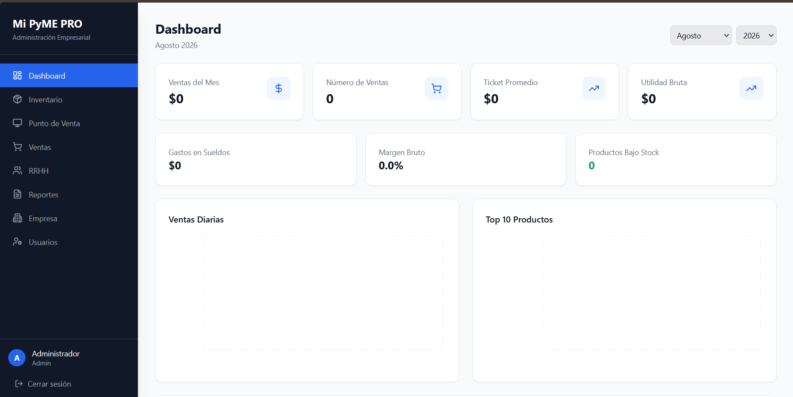
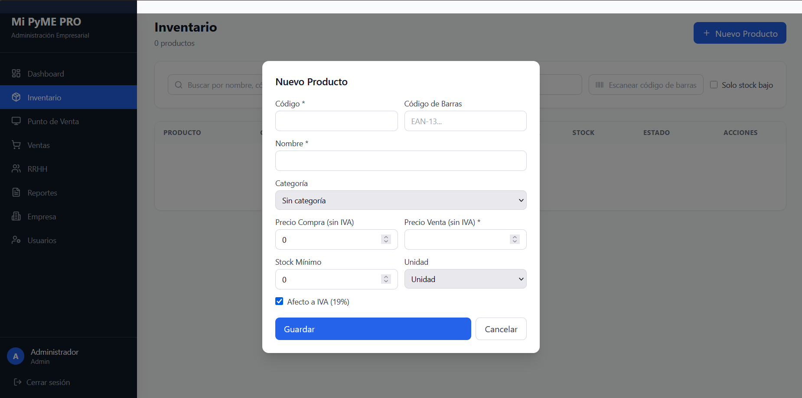
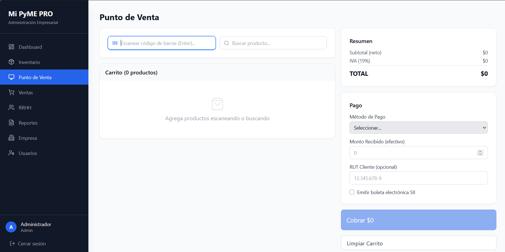
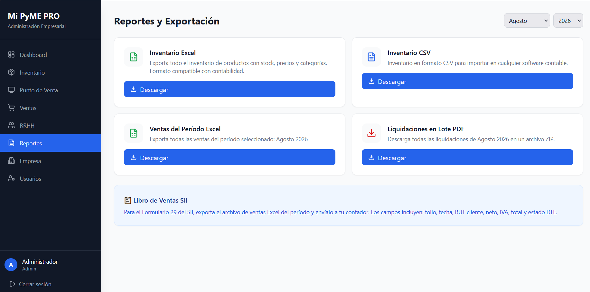
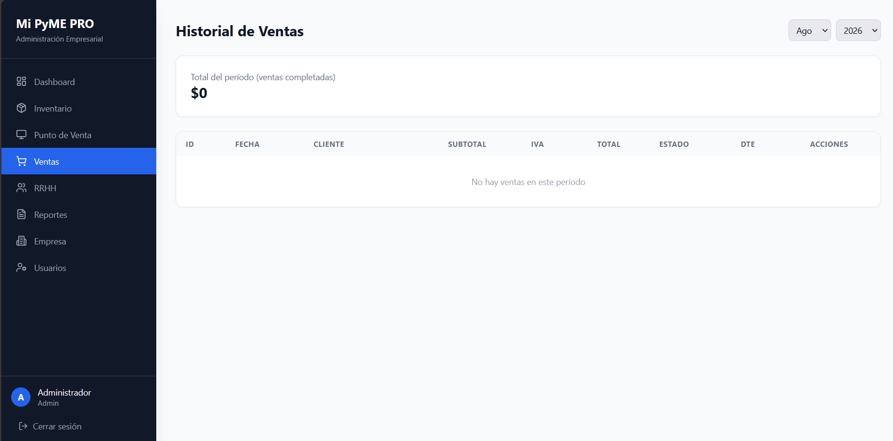
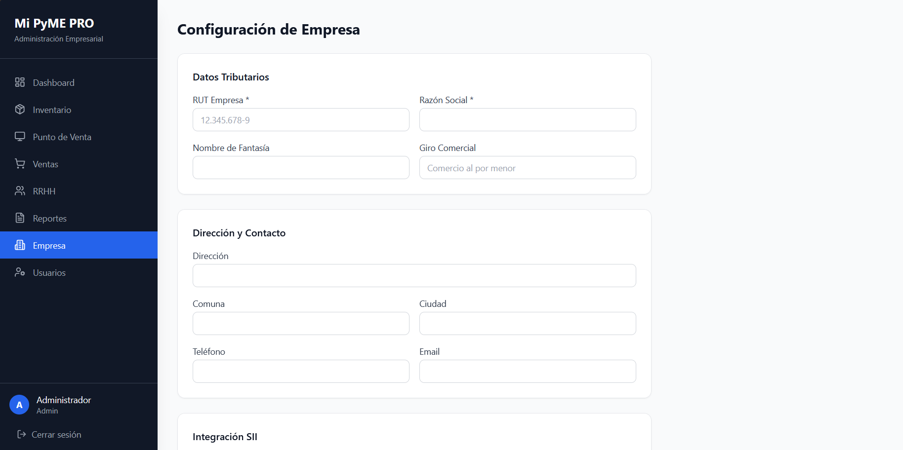
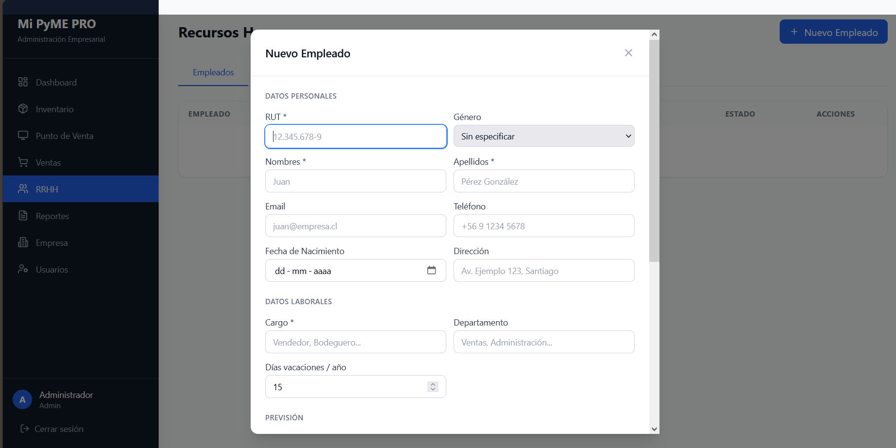

# 🚀 MiPymePro - ERP para PyMEs potenciado por IA

MiPymePro es un sistema integral de planificación de recursos empresariales diseñado específicamente para el mercado chileno. Desarrollado íntegramente mediante **Inteligencia Artificial (Zencoder)**, permitiendo una arquitectura robusta y escalable.

## 📸 Vista Previa del Sistema

### 📊 Pantalla de Inicio

### 🛒 Gestión de Inventario

### 💰 Punto de Venta

### 📈 Reportes y Estadísticas

### 📑 Historial de Ventas

### 🏢 Módulo de Empresa y RRHH

## 🛠️ Stack Tecnológico
- **Frontend & Backend:** Desarrollado con asistencia de IA (Zencoder).
- **Lenguaje:** Python.
- **Base de Datos:** PostgreSQL.
- **Integraciones:** API SII Chile para facturación.
